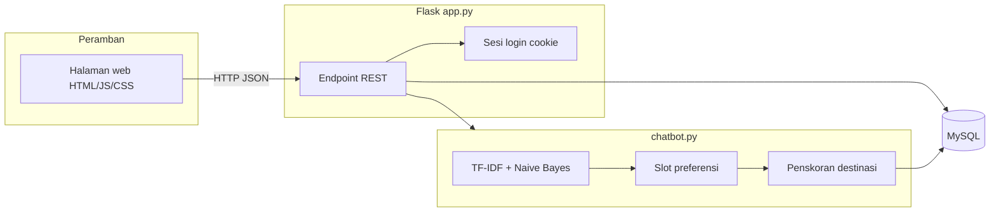

# Dokumen Presentasi — Sistem Rekomendasi Wisata Bali (BaliGuide)

Dokumen ini merangkum deskripsi sistem, alur kerja, dan peran file utama di repositori. Cocok sebagai bahan slide atau lembar penjelasan saat presentasi.

---

## 1. Deskripsi singkat

**BaliGuide** adalah aplikasi **berbasis web** untuk menjelajahi dan mendapatkan **rekomendasi destinasi wisata di Bali**. Pengguna mendaftar dan masuk, lalu dapat:

- mencari dan menyaring wisata (nama, kategori, urutan rating/harga);
- melihat peta dan rute;
- menyimpan **favorit** dan **riwayat kunjungan**;
- memberi **ulasan**;
- mengisi **preferensi perjalanan**;
- berinteraksi lewat **panel percakapan** yang menggabungkan klasifikasi teks dan penskoran destinasi.

Data wisata disimpan di **MySQL** (misalnya dikelola lewat phpMyAdmin). Server aplikasi menggunakan **Python Flask**.

---

## 2. Metode penelitian (penyesuaian bagian metode pada judul)

**Judul lengkap — tepat 14 kata — dengan metode yang selaras implementasi:**

**RANCANG BANGUN SISTEM REKOMENDASI PARIWISATA BALI BERBASIS WEB DENGAN TF-IDF NAÏVE BAYES PENSKORAN PREFERENSI.**

*(Penghitungan: Rancang, Bangun, Sistem, Rekomendasi, Pariwisata, Bali, Berbasis, Web, Dengan, TF-IDF, Naïve, Bayes, Penskoran, Preferensi.)*

**Inti metode:**

1. **Klasifikasi maksud percakapan** — kalimat pengguna divisualisasikan dengan TF-IDF, lalu dilabeli dengan Naïve Bayes (data latih berpasangan teks–intent) agar sistem memahami jenis permintaan (misalnya pantai, alam, lokasi, anggaran).
2. **Pengisian preferensi bertahap** — sebelum rekomendasi penuh, sistem mengumpulkan slot preferensi (tipe perjalanan, budget, mood, hobi, area) lewat dialog.
3. **Rekomendasi berbasis skor** — destinasi diperingkat dengan fungsi skor yang memadukan rating, kategori, kabupaten, inferensi tag dari teks deskripsi/aktivitas, dan kesesuaian dengan preferensi tersimpan.
4. **Penjelajahan berbasis basis data** — pada antarmuka utama, penyaringan nama/kategori dan pengurutan rating atau harga dilakukan lewat query ke MySQL.

Dengan formulasi di atas, klaim metode pada judul **mengikuti** apa yang benar-benar di-build (bukan *content-based filtering* klasik berbasis similarity vektor konten item–pengguna).

---

## 3. Bagaimana sistem bekerja (alur besar)

**Alur pengguna tipikal**

1. **Registrasi / login** — Kredensial di-hash (bcrypt), sesi disimpan di server.
2. **Halaman utama (`/ui`)** — Memuat daftar wisata dari endpoint `/rekomendasi` dan `/kategori`; peta memakai koordinat dari basis data.
3. **Filter** — Parameter pencarian (nama, kategori, urutan) diteruskan ke query SQL; hasil diurutkan sesuai pilihan (rating atau harga tiket).
4. **Asisten percakapan** — Pesan pengguna dikirim ke `/chatbot`; backend memanggil `chat_response()`:
   - teks diproses dan **maksud (intent)** diklasifikasi dengan **TF-IDF + Naive Bayes**;
   - **preferensi** (tipe perjalanan, budget, mood, hobi, dll.) dikumpulkan bertahap bila belum lengkap;
   - setelah cukup informasi, destinasi di **peringkat** dengan fungsi penskoran (kategori, lokasi, tag profil tempat, rating, kecocokan preferensi).
5. **Preferensi tersimpan** — Endpoint `/preferences` menyimpan profil ke tabel `user_preferences` untuk dipakai lagi pada kunjungan berikutnya.
6. **Admin** — Peran admin dapat mengelola data wisata lewat endpoint `/admin/wisata` dan halaman admin (setelah login admin).

---

## 4. Teknologi utama

| Lapisan | Teknologi |
|--------|-----------|
| Backend | Python 3, Flask, PyMySQL, bcrypt |
| Frontend | HTML, CSS, JavaScript, Bootstrap & Font Awesome (lokal di `static/plugins/`), Leaflet untuk peta |
| Basis data | MySQL |
| Pembelajaran mesin (percakapan) | scikit-learn (TfidfVectorizer, MultinomialNB, Pipeline), pandas |
| Data tabular wisata | CSV `dataset_wisata_bali.csv` (seed awal / cadangan isi tabel `wisata`) |

---

## 5. Fungsi file dan folder (intisari)

### Akar proyek (kode aplikasi)

| File | Fungsi |
|------|--------|
| `app.py` | Aplikasi Flask: koneksi MySQL, rute API (auth, profil, wisata, ulasan, favorit, riwayat, chatbot, preferensi, admin), render template, seed awal `wisata` dari CSV jika tabel kosong. |
| `chatbot.py` | Logika asisten: data latih intent, model NB+TF-IDF, ekstraksi preferensi dari teks, pertanyaan slot, peringkat destinasi (`score_row` / `get_ranked_recommendations`), respons HTML ke pengguna. |
| `intent_training_extra.py` | Daftar kalimat latih tambahan untuk intent; digabung dengan data inti di `chatbot.py` saat model dilatih ulang saat startup. |
| `create_admin.py` | Skrip sekali jalan: membuat akun pengguna dengan peran `admin` di basis data. |
| `dataset_wisata_bali.csv` | Dataset destinasi untuk impor awal ke tabel `wisata` (melalui `seed_wisata_records` di `app.py`). |

### Skrip pendukung (di luar operasi server harian)

| File | Fungsi |
|------|--------|
| `scraping_wisata_bali.py` | Mengambil data dari API eksternal (OpenTripMap) dan menulis CSV baru; opsional untuk memperkaya dataset. |
| `model_improved.py` | Pelatihan model teks terpisah (TF-IDF, stemming Sastrawi, export `joblib`); untuk eksperimen / perbandingan akurasi. |
| `test_comparison.py` | Membandingkan performa model dengan/tanpa preprocessing tertentu pada data yang sama. |

### Pengujian

| File | Fungsi |
|------|--------|
| `tests/test_auth.py` | Pengujian otomatis terkait alur autentikasi (jika dijalankan dengan pytest / runner yang sesuai). |

### Antarmuka

| File | Fungsi |
|------|--------|
| `templates/index.html` | Dashboard utama pengguna: daftar wisata, peta, favorit, riwayat, panel percakapan, preferensi. |
| `templates/login.html` | Halaman login pengguna biasa. |
| `templates/profile.html` | Halaman profil pengguna. |
| `templates/admin_login.html` | Login khusus admin. |
| `templates/admin.html` | Panel pengelolaan data wisata untuk admin. |

### Aset statis

| File / folder | Fungsi |
|---------------|--------|
| `static/css/styles.css` | Gaya tampilan utama (layout, sidebar, peta, panel chat). |
| `static/css/login.css` | Gaya halaman login. |
| `static/plugins/` | Pustaka siap pakai (Bootstrap, Font Awesome, AdminLTE, dll.); tidak perlu diubah untuk logika bisnis. |

### Dokumentasi

| File | Fungsi |
|------|--------|
| `DOKUMEN_PRESENTASI.md` | Ringkasan sistem untuk presentasi (dokumen ini). |
| `PANDUAN_MELATIH_MODEL.md` | Panduan melatih / memperkaya model teks terkait proyek. |
| `CHECKLIST_IMPLEMENTASI.md` | Checklist langkah implementasi dan pengujian model. |

### Konfigurasi repositori

| File | Fungsi |
|------|--------|
| `.gitignore` | Mengabaikan berkas artefak (`__pycache__`, venv, dll.) dari version control. |

---

## 6. Endpoint API (referensi cepat)

- **Auth:** `POST /register`, `POST /login`, `GET /logout`, `GET /me`, `PUT /profile`
- **Wisata:** `GET /rekomendasi`, `GET /wisata/<id>`, `GET /kategori`, `GET /rute`
- **Interaksi:** `GET|POST /ulasan`, `GET|POST|DELETE /suka`, `GET|POST|DELETE /riwayat`
- **Percakapan:** `POST /chatbot`, `GET|PUT /chatbot/session`, `GET|POST /chatbot/history`
- **Preferensi:** `GET|PUT /preferences`
- **Admin:** `POST /admin/login`, `GET|POST|PUT|DELETE /admin/wisata`

Detail validasi dan struktur JSON mengikuti implementasi di `app.py`.

---

## 7. Menjalankan aplikasi (ringkas)

1. Siapkan basis data MySQL (skema sesuai kebutuhan tabel: `users`, `wisata`, `ulasan`, `suka`, `riwayat_kunjungan`, `user_preferences`, `chatbot_sessions`, `chatbot_messages`, dll.).
2. Atur variabel lingkungan atau default di `app.py` untuk host, user, password, nama basis data.
3. Instal dependensi Python yang dipakai proyek (Flask, PyMySQL, bcrypt, pandas, scikit-learn, dll.).
4. Jalankan: `python app.py` (atau `flask run` dengan `FLASK_APP=app`).
5. Buka halaman login sesuai rute (`/login-page`), lalu gunakan `/ui` setelah login.

---

## 8. Poin untuk slide presentasi

- **Masalah:** pengunjung butuh cara cepat menemukan wisata yang sesuai minat, budget, dan lokasi.
- **Solusi:** satu portal web dengan pencarian, peta, dan asisten percakapan berbasis preferensi + klasifikasi maksud.
- **Data:** MySQL sebagai sumber kebenaran; CSV untuk inisialisasi dataset.
- **Keamanan dasar:** hash password, cookie sesi, pemisahan peran admin.
- **Unsur “cerdas”:** intent dari pesan pengguna (NB + TF-IDF) dan ranking destinasi dari fitur tersimpan + teks deskripsi.

---

*Dokumen ini menggambarkan struktur proyek pada saat penyusunan; jika ada penambahan file baru, sesuaikan bagian daftar file dengan kondisi repositori terkini.*
